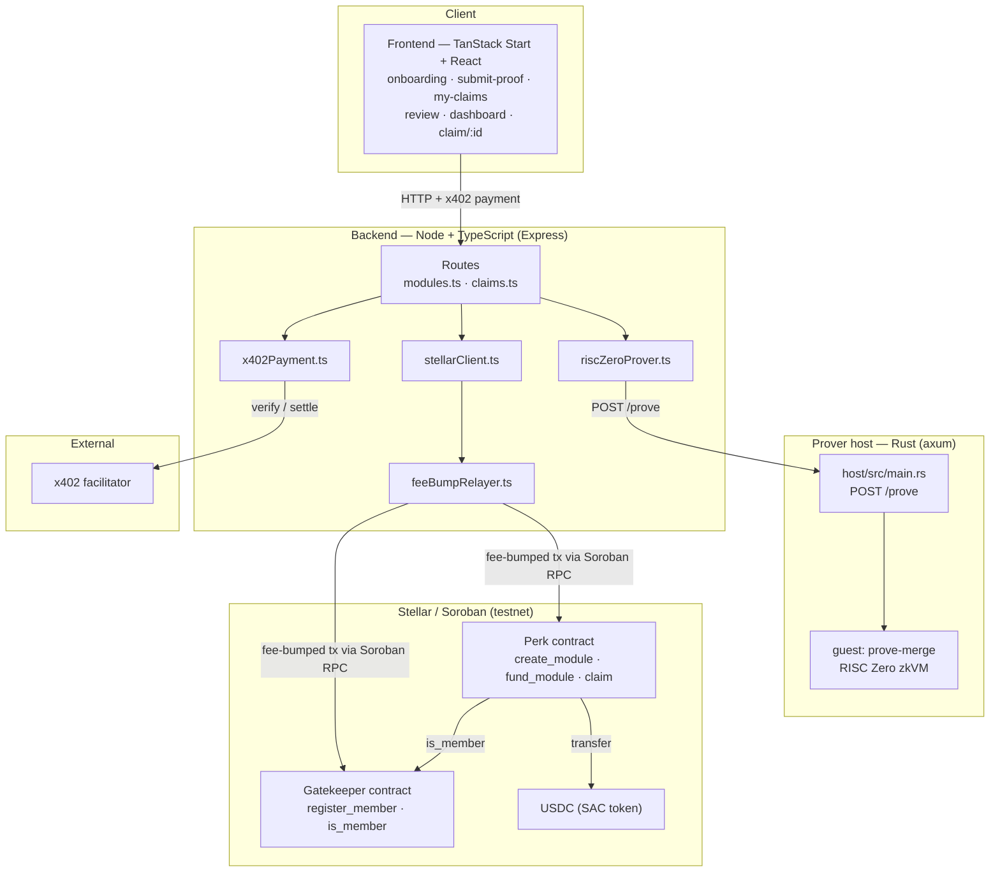
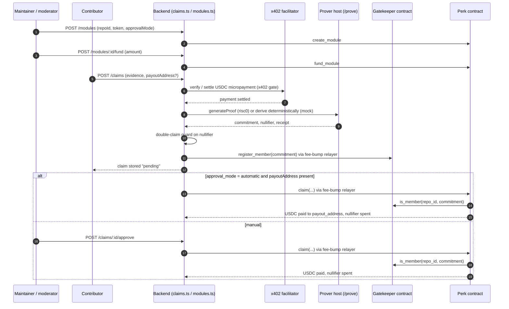
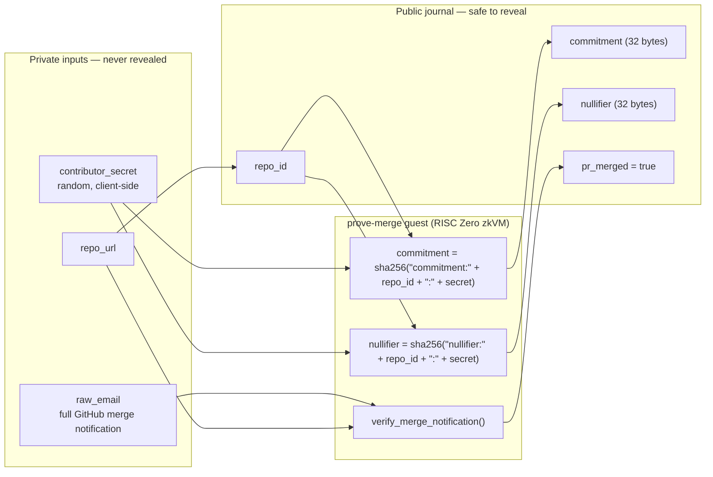

<div align="center">


# hiPerk

**Anonymous, gas-free rewards for open-source contributors on Stellar.**

Prove you landed a merged pull request into a Stellar-ecosystem GitHub repository and get paid in USDC — without revealing your identity, and without paying any network fee.

</div>

---

## What it is

hiPerk pays open-source contributors for work that provably happened, while proving nothing about who did it.

A contributor submits a zero-knowledge proof that a specific GitHub pull request was merged into a specific repository. The proof reveals only an anonymous membership commitment and a per-claim nullifier — never the contributor's GitHub identity, email, or the raw notification the proof was built from. Payment is settled in USDC on Stellar through a fee-bump relayer, so the contributor pays no transaction fee.

Three technologies carry the system, each present in this repository:

1. **RISC Zero zkVM** — proves "a PR merged into repo X" from a GitHub merge-notification email, emitting only a commitment and a nullifier. The raw email and the contributor's secret never leave the proof boundary.
2. **x402** — an HTTP-native stablecoin payment protocol that revives HTTP 402. `POST /claims` is metered per proof behind a USDC micropayment on Stellar, verified and settled by a facilitator. The backend never custodies funds; it only declares a price and a `payTo` address.
3. **Stellar / Soroban** — a Gatekeeper contract and a Perk contract (Rust / WASM). Fee-bump transactions make the flow gas-free for the contributor.

## Use case

Under-resourced open-source projects want more contributors, but public bounties exclude developers who cannot or will not claim a reward publicly: employees of competing projects, contributors in restrictive jurisdictions, or anyone who simply values privacy.

hiPerk proves the *work* — a merge — while proving nothing about the *worker*. A funder such as the Stellar Development Foundation or a project team sees only aggregate, anonymous claim statistics. The contributor collects a reward and remains unlinkable to the contribution.

## Architecture

hiPerk is four cooperating layers: a web frontend, a Node/TypeScript backend, a Rust prover host running the zkVM, and two Soroban contracts on Stellar.



- **Frontend** — a TanStack Start + React application serving the contributor portal and maintainer dashboard. Routes: onboarding, submit-proof, my-claims, review, dashboard, and `claim/$id` (TanStack file-route syntax).
- **Backend** — Node + TypeScript on Express. Routes in [backend/src/routes/modules.ts](backend/src/routes/modules.ts) and [backend/src/routes/claims.ts](backend/src/routes/claims.ts); services in [backend/src/services/stellarClient.ts](backend/src/services/stellarClient.ts), [backend/src/services/feeBumpRelayer.ts](backend/src/services/feeBumpRelayer.ts), [backend/src/services/riscZeroProver.ts](backend/src/services/riscZeroProver.ts), and [backend/src/services/x402Payment.ts](backend/src/services/x402Payment.ts). Mode flags live in [backend/src/config.ts](backend/src/config.ts).
- **Prover host** — a Rust workspace under [backend/prover](backend/prover). The zkVM guest program `prove-merge` is [backend/prover/methods/guest/src/main.rs](backend/prover/methods/guest/src/main.rs); the axum HTTP server exposing `POST /prove` is [backend/prover/host/src/main.rs](backend/prover/host/src/main.rs). Proving is local, via RISC Zero `default_prover()` — no external marketplace and no second chain, deliberately keeping the system Stellar-only.
- **Contracts** — Soroban contracts in [blockchain/contracts/gatekeeper/src/lib.rs](blockchain/contracts/gatekeeper/src/lib.rs) and [blockchain/contracts/perk/src/lib.rs](blockchain/contracts/perk/src/lib.rs) (Rust, `no_std`).

## Claim lifecycle

A maintainer funds a module; a contributor pays per proof, generates a proof, registers an anonymous commitment, and is paid out either automatically or after manual review.



Endpoints, per [backend/src/routes/claims.ts](backend/src/routes/claims.ts) and [backend/src/routes/modules.ts](backend/src/routes/modules.ts):

| Method | Route | Purpose |
|---|---|---|
| `POST` | `/modules` | Maintainer creates a module — calls `Perk.create_module`. |
| `POST` | `/modules/:id/fund` | Maintainer funds the module pool — calls `Perk.fund_module`. |
| `GET` | `/modules` | List modules for the dashboard. |
| `POST` | `/claims` | Contributor submits evidence; passes the x402 gate, generates a proof, guards the nullifier, and registers the commitment. Claim stored `pending`. |
| `GET` | `/claims/:id` | Poll a claim's status. Returns no identity fields. |
| `GET` | `/claims` | Anonymous review queue for moderators. |
| `POST` | `/claims/:id/approve` | Moderator approves — calls `Perk.claim`, paying out USDC and spending the nullifier. |
| `POST` | `/claims/:id/reject` | Moderator rejects. |

If a module's `approval_mode` is `automatic` and a `payoutAddress` is present, payout happens immediately after proof registration; otherwise it waits for a moderator to approve.

## Zero-knowledge design

The zero-knowledge layer answers one question — *did a pull request merge into this repository?* — and reveals nothing else.

The description below is scoped to `PROVER_MODE=risc0`, the real zkVM path. In the default offline mode (`PROVER_MODE=mock`) the backend derives the commitment and nullifier deterministically from the submitted evidence text rather than from a client-side secret; see [Configuration and modes](#configuration-and-modes).

### Private in, public out

The `prove-merge` guest program takes three private inputs and commits four public outputs. The private inputs are read into the zkVM and never appear in the journal.



### Guest inputs and outputs

Private input, per [backend/prover/methods/guest/src/main.rs](backend/prover/methods/guest/src/main.rs):

- `raw_email` — the full raw GitHub merge-notification email, headers included.
- `repo_url` — the repository URL as pasted by the contributor.
- `contributor_secret` — a random secret generated client-side; only its hashes ever leave the guest.

Public journal output (safe to reveal, never traceable to a GitHub identity):

- `repo_id` — a sanitized identifier derived from `repo_url`.
- `commitment = sha256("commitment:" + repo_id + ":" + contributor_secret)`.
- `nullifier = sha256("nullifier:" + repo_id + ":" + contributor_secret)`.
- `pr_merged = true`.

Both `commitment` and `nullifier` are 32-byte SHA-256 digests, carried on-chain as `BytesN<32>`.

### Roles of the two values

- **commitment** — an anonymous membership credential. The backend registers it in the Gatekeeper contract via `register_member`. It proves the holder belongs to a repository's verified contributor group without identifying them.
- **nullifier** — a deterministic per-claim tag. The Perk contract marks it spent on payout under `DataKey::Nullifier(module_id, nullifier)`, so it prevents a repeat payout within a given module's pool — while the contract never learns who claimed. Because the value is derived from `repo_id` and the contributor's secret, the same contributor claiming the same merge always produces the same nullifier.

### Verification

`verify_merge_notification()` checks that the email is a genuine GitHub PR-merge notification for the given repository. The zkVM produces a receipt; the prover host re-verifies it with `receipt.verify(PROVE_MERGE_ID)` before decoding the journal, and rejects the request if `pr_merged` is not `true`. In local proving mode the response returns the full bincode-serialized `Receipt` (re-verifiable against the image ID) rather than a compact on-chain SNARK seal — there is no on-chain verifier target in this mode.

### Honest caveat — DKIM is stubbed

DKIM signature verification inside the guest is **currently stubbed**. `verify_merge_notification()` checks only the structural shape of the notification: that it comes from `notifications@github.com`, contains the keyword `merged`, and references the repository. It does **not** cryptographically verify GitHub's DKIM signature, so a hand-crafted email could pass this check.

Real DKIM verification — parsing the `DKIM-Signature` header and verifying it against GitHub's published `github.com._domainkey` public key with the `rsa` / `pkcs1` crates — must be implemented before proofs are trustworthy beyond a demo. See [backend/prover/README.md](backend/prover/README.md).

## x402 pay-per-proof

`POST /claims` is metered per proof behind a USDC micropayment. The backend declares a price and a `payTo` address; an x402 facilitator verifies and settles the payment on Stellar. The backend never custodies funds.

Enforcement is gated by configuration in [backend/src/config.ts](backend/src/config.ts). Payment is only enforced when `X402_MODE=live` **and** a valid `http(s)` `X402_FACILITATOR_URL` **and** `X402_PAY_TO` are set. Any other configuration falls through to a pass-through mock, so the flow runs end-to-end without a facilitator. A non-URL facilitator value is rejected with a warning and treated as mock, rather than crashing on `fetch`.

## Stellar and the fee-bump relayer

Contributors never pay network fees. The relayer keypair (`RELAYER_SECRET_KEY`, never exposed to the frontend) is both the trusted contract caller and the fee sponsor.

`sponsorAndSubmit()` in [backend/src/services/feeBumpRelayer.ts](backend/src/services/feeBumpRelayer.ts) wraps the relayer-signed inner transaction in a `FeeBumpTransaction` paid by the relayer, submits it via the Soroban RPC, and polls `getTransaction` until it reaches `SUCCESS` or `FAILED`. Every contributor-triggered on-chain action routes through this path, so contributors incur no network fee.

## Smart contracts

Both contracts are Rust / Soroban / `no_std`.

### Gatekeeper — [blockchain/contracts/gatekeeper/src/lib.rs](blockchain/contracts/gatekeeper/src/lib.rs)

Registers anonymous membership commitments per repository group after the backend has verified a proof.

- `register_member(caller, repo_id: Symbol, commitment: BytesN<32>)` — only the trusted relayer may call.
- `is_member(repo_id, commitment) -> bool` — read-only membership check, used by the Perk contract.
- Membership is stored under `DataKey::Member(repo_id, commitment)`.

### Perk — [blockchain/contracts/perk/src/lib.rs](blockchain/contracts/perk/src/lib.rs)

Holds a funded reward pool per module, validates anonymous claims, prevents double-claiming, and pays out.

- `create_module(admin, module_id, repo_id, token: Address, approval_mode)` — creates a module bound to a repository and token.
- `fund_module(funder, module_id, amount: i128)` — deposits tokens into the module pool.
- `claim(caller, module_id, commitment, nullifier, payout_address, amount)` — the caller must be the trusted relayer. It cross-checks `Gatekeeper.is_member`, rejects a reused nullifier, and transfers the token from the pool to `payout_address` via the SAC token client.
- `get_module(module_id)` — read-only pool and configuration view.

The token is a Soroban Stellar Asset Contract (SAC) address, for example testnet USDC. `approval_mode` is `"manual"` or `"automatic"`; it is informational on-chain and enforced off-chain by the backend.

## Configuration and modes

All modes default to a fully offline mock so the entire flow runs with no chain, prover, or facilitator. Flags are resolved in [backend/src/config.ts](backend/src/config.ts).

| Flag | Values | Behavior |
|---|---|---|
| `CHAIN_MODE` | `auto` \| `mock` \| `live` | `live` when contracts and the relayer key are set (or when forced). `auto` goes live only if `GATEKEEPER_CONTRACT_ID`, `PERK_CONTRACT_ID`, and `RELAYER_SECRET_KEY` are all present. |
| `PROVER_MODE` | `mock` \| `risc0` | `mock` derives the commitment and nullifier deterministically from the submitted evidence text. `risc0` calls the prover host at `PROVER_SERVICE_URL`. |
| `X402_MODE` | `mock` \| `live` | `live` enforcement requires a valid `http(s)` `X402_FACILITATOR_URL` and `X402_PAY_TO`; otherwise the gate is a pass-through mock. |

Relevant environment variables include `STELLAR_NETWORK`, `SOROBAN_RPC_URL`, `GATEKEEPER_CONTRACT_ID`, `PERK_CONTRACT_ID`, `RELAYER_SECRET_KEY`, `ADMIN_PUBLIC_KEY`, `PROVER_MODE`, `PROVER_SERVICE_URL`, `X402_MODE`, `X402_FACILITATOR_URL`, `X402_PAY_TO`, `X402_NETWORK`, and `PORT`.

## Quickstart

The default configuration is fully offline mock — no chain, prover, or facilitator required.

```bash
# Backend (mock mode, out of the box)
cd backend
npm install
npm run dev            # Express server on PORT (default 4000)

# Frontend
cd frontend
npm install
npm run dev            # TanStack Start + React app

# Optional: real local proving (RISC Zero toolchain required)
curl -L https://risczero.com/install | bash
rzup install
cd backend/prover
cargo run --release --bin host     # listens on :8080 (PROVER_LISTEN_ADDR to override)
# then set PROVER_MODE=risc0 and PROVER_SERVICE_URL=http://localhost:8080

# While iterating on the prover, skip real proving for fast unproven receipts:
RISC0_DEV_MODE=1 cargo run --release --bin host
```

For live-testnet readiness and a smoke test, see [test-live.sh](test-live.sh).

## Repository layout

```
hiPerk/
├── assets/
│   └── banner.png
├── frontend/                          TanStack Start + React web app
├── backend/
│   ├── src/
│   │   ├── config.ts                  mode flags (chain / prover / x402)
│   │   ├── routes/
│   │   │   ├── modules.ts             maintainer module + funding endpoints
│   │   │   └── claims.ts              claim submission, review, payout
│   │   └── services/
│   │       ├── stellarClient.ts       Soroban contract calls
│   │       ├── feeBumpRelayer.ts      fee-bump sponsorship + submission
│   │       ├── riscZeroProver.ts      prover host client / mock derivation
│   │       └── x402Payment.ts         x402 payment gate
│   └── prover/                        Rust workspace (RISC Zero)
│       ├── methods/guest/src/main.rs  prove-merge zkVM guest
│       ├── host/src/main.rs           axum HTTP server (POST /prove)
│       └── README.md                  prover setup + DKIM caveat
├── blockchain/
│   └── contracts/
│       ├── gatekeeper/src/lib.rs      membership registry
│       └── perk/src/lib.rs            funded pools + anonymous payout
├── plan.md                            architecture + rationale
├── implementation.md                  interfaces + data model
└── test-live.sh                       live-testnet checklist + smoke test
```

## Status and limitations

- **DKIM verification is stubbed.** The guest only checks the structural shape of the merge notification, not GitHub's real DKIM signature. This must be implemented before proofs are trustworthy beyond a demo.
- **Proving is local and CPU-bound.** Once real DKIM verification is added, local STARK proving can take seconds to tens of seconds depending on hardware. No GPU acceleration is wired in.
- **Local proving emits a full `Receipt`, not a compact on-chain seal.** There is no on-chain verifier target in this mode; membership and nullifier enforcement are handled by the backend relayer and the Perk contract.
- **The nullifier guard is per module.** It is marked spent under `DataKey::Nullifier(module_id, nullifier)`, preventing a repeat payout within a single module's pool.
- **Defaults are mock.** Chain, prover, and x402 all default to offline mock so the full flow runs with no external configuration.

## Further reading

- [plan.md](plan.md) — architecture and design rationale.
- [implementation.md](implementation.md) — contract interfaces, API routes, and the data model.
- [backend/prover/README.md](backend/prover/README.md) — prover setup and the DKIM caveat.
- [test-live.sh](test-live.sh) — live-testnet readiness checklist and smoke test.
